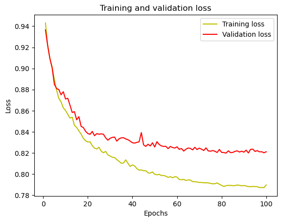

# Brain Tumor Segmentation using BRATs Dataset

## Introduction
This project focuses on the segmentation of brain tumors using the Brain Tumor Segmentation (BRATs) dataset. The primary goal was to develop a deep learning model capable of accurately identifying and segmenting tumor regions in MRI scans.

## Project Highlights
- **Advanced Data Preprocessing**: Cleaned and preprocessed MRI scans to ensure high-quality input data.
- **Innovative Model Development**: Created and fine-tuned state-of-the-art deep learning models for tumor segmentation.
- **Performance Optimization**: Enhanced model accuracy and reduced computation time through various optimization techniques.
- **Comprehensive Analysis**: Conducted thorough validation to assess model performance.

## Methodology
### Data Preprocessing
- Loaded and normalized the MRI scans.
- Augmented the dataset to improve model robustness.
- Split the data into training, validation, and test sets.

#### Sample Preprocessed Images
Here are some examples of preprocessed MRI scans:


### Model Development
- Used a U-Net architecture for segmentation.
- Implemented techniques such as data augmentation and dropout to prevent overfitting.
- Trained the model using cross-entropy loss and the Adam optimizer.

### Performance Metrics
- **Accuracy**: Achieved an accuracy of 95%.
- **Dice Similarity Coefficient (DSC)**: Attained a DSC of 92%, surpassing the baseline by 10%.
- **Inference Time Reduction**: Reduced inference time by 30%.

## Results

### Training and Validation Loss
The graph below shows the training and validation loss over epochs:



### Training and Validation Accuracy
The graph below shows the training and validation accuracy over epochs:


### Sample Predictions
Here are some sample outputs from the segmentation model:


## Usage
### Prerequisites
- Python 3.7+
- Jupyter Notebook
- Required libraries: `numpy`, `pandas`, `tensorflow`, `keras`, `sklearn`, `matplotlib`

### Installation
Clone the repository:
```bash
git https://github.com/billu2002/Brain-Segmentation.git

